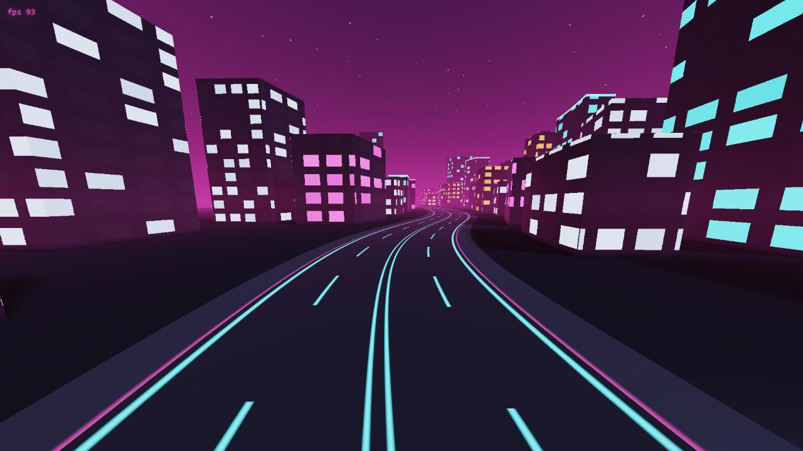

# Neon Raymarcher

> An endless synthwave city rendered from distance fields—no meshes, textures, or scene graph required.




## Overview

Neon Raymarcher is a real-time WebGL2 experiment that flies through an infinite procedural city. A fullscreen triangle invokes a fragment shader for every pixel; sphere tracing and signed-distance functions create the ground, road, buildings, windows, fog, and glow entirely from math.

## Rendering highlights

- Raymarches signed-distance fields in a single fullscreen fragment shader.
- Repeats deterministic city blocks in road space to create an endless skyline.
- Shares hashing and analytic road constants between CPU TypeScript and GPU GLSL.
- Paints road markings as materials on the ground plane, avoiding extra geometry.
- Uses tiered building rows, hashed windows, neon accents, fog, and a moving path camera.
- Exposes a render-scale control in the renderer for performance tuning.
- Surfaces WebGL and shader compilation errors in the on-screen HUD.

## Architecture

```text
src/game/       Analytic road, deterministic hashing, and camera motion
src/render/     WebGL2 program lifecycle and frame uniforms
src/render/shaders/
                 Fullscreen vertex shader and raymarched city fragment shader
```

## Run locally

```bash
npm install
npm run dev
```

Production build:

```bash
npm run build
npm run preview
```

A browser with WebGL2 support is required.

## Video walkthrough

> 🎬 **Coming soon** — reserved for a continuous flight through the procedural city.
